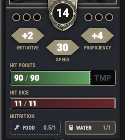
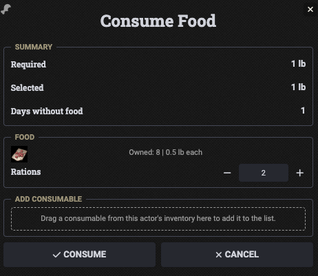
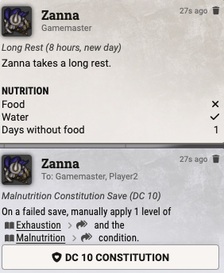

# Simple Nutrition 5e

Simple Nutrition 5e tracks daily food and water for `dnd5e` characters and applies the related rest consequences for dehydration and malnutrition. Supports both the modern (2024) and Legacy (2014) rules, detected automatically from the system's rules version.

## Features

### Daily tracking
- Tracks food and water separately for each character.
- Calculates daily requirements from actor size.
- Shows the current progress directly on the character sheet.
- Supports Tidy 5e Sheets with compact header buttons.
- Uses the current `dnd5e` display settings for metric weight and volume where applicable.

### Actor configuration
- In sheet edit mode, a config button appears next to the nutrition tracker.
- Food and water tracking can each be disabled independently per actor.
- Supports actor-specific overrides for daily food, daily water, starvation threshold, and the saving throw DC — starvation threshold and DC accept formulas (e.g. `3 + @abilities.con.mod`).
- Empty config fields fall back to the module defaults based on actor size and rules version.

### Consume dialog
- Open food and water consumption directly from the actor sheet.
- Shows the required amount for the day and the currently selected amount.
- Supports consuming from already listed inventory items.
- Supports drag and drop for additional consumables from the same actor inventory.
- Supports `Fresh Water Source Available` for drinking without consuming carried water.
- Supports a free food option for eating without spending items (e.g. a tavern meal).

### Rest integration
- Evaluates nutrition on a long rest that starts a new day, or once per calendar midnight when `dnd5e`'s own calendar-driven recovery is active — either on `dnd5e` 6.0.0+, or automatically whenever the Ember module is managing rests.
- Modern rules: drinking less than half the required water applies Exhaustion automatically; eating less than half the required food calls for a Constitution saving throw instead, unless 5 consecutive days without food have already passed, in which case Exhaustion is applied automatically without a save.
- Legacy rules: eating less than half a day's food adds to a running "days without food" counter that applies Exhaustion automatically once it exceeds a Constitution-modifier-based threshold; drinking less than half the required water applies Exhaustion automatically, drinking between half and the full amount calls for a Constitution saving throw instead — either case deals 2 levels instead of 1 if the character is already exhausted.
- The saving throw roll button shows the pass/fail result inline and offers a separate "Apply Exhaustion" button for manual control.
- Adds a short nutrition summary to the resulting rest or calendar chat message, skipped when both requirements are already met.

### Conditions
- Modern rules: uses the `Dehydrated` and `Malnutrition` conditions to represent blocked Exhaustion recovery, removed as soon as the character fully satisfies the relevant daily requirement.
- Legacy rules: has no equivalent conditions — Exhaustion recovery on a long rest is blocked directly whenever the full daily food or water requirement wasn't met that day.
- Keeps existing Exhaustion unchanged until it is removed through the normal game workflow.

## Example

  
  
  

  <em>Daily tracking</em> · <em>Consume dialog</em> · <em>Rest summary</em>

